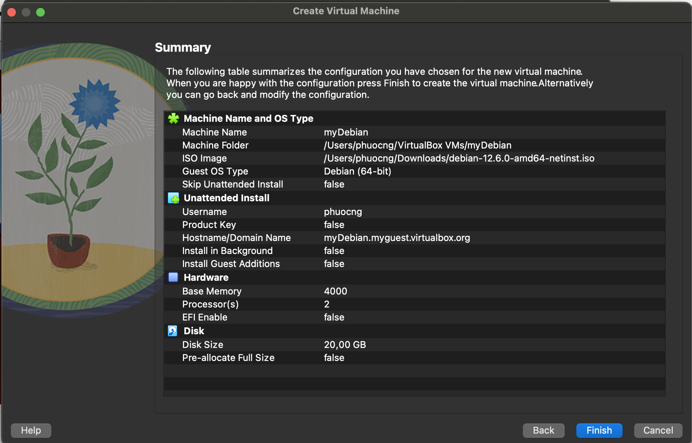
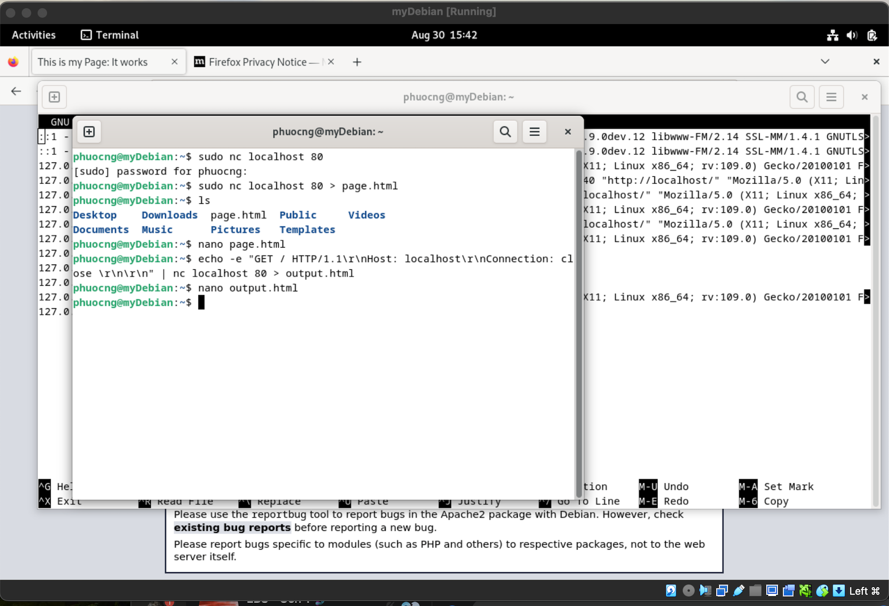
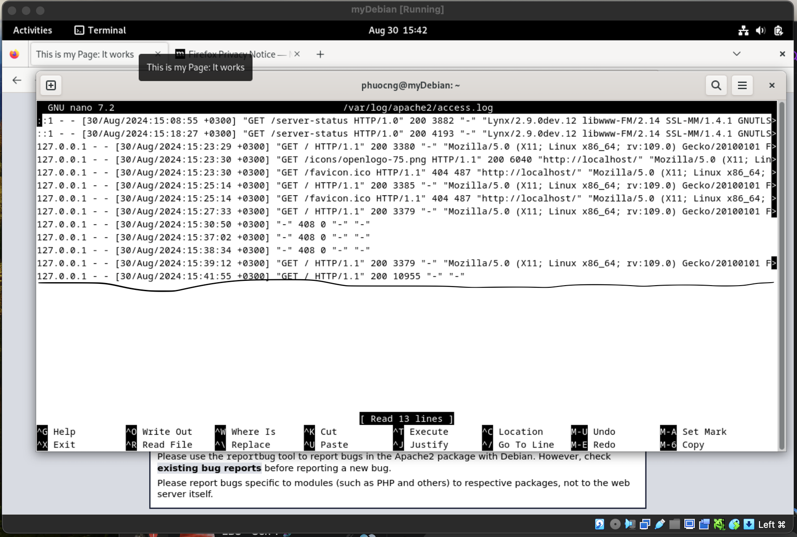

# Intelligence-Driven Computer Network Defense Informed by Analysis of Adversary Campaigns and Intrusion Kill Chain.

## Intelligence-driven Computer Network Defense:
- A risk management strategy addressing attackers, their capabilities, objectives.
- It requires the defender to understand the attacker’s mindset, like you are themselves.
- Thus, you could implement countermeasures faster.

## Indicators
There is 3 types of indicators :**Atomic, Computed, Behavioral**
- **Atomic**: IP Address, email address, personal identity, social network.
- **Computed**: Processing of raw data.
- **Behavioral**: collect of Atomatic and computed.

## Kill chain follow these steps:
- **Reconnaissance**: select target. (Email address, social network).
- **Weaponization**: sending an automated tool as a trojan.
- **Delivery**: send the trojan to the target.
- **Exploitation**: the automated tool triggered and started exploitation of the system vulnerability.
- **Installation**: install a backdoor for easy access.
- **C2**: When the installation is done, the intruder can access to target system.
- **Objectives**: The intruders get what they are aimed for.

# Debian detail

Name: myDebian
Type: Linus
Version: 64-bits
Process: 2.
Base memory: 4000 MB.
Hard disk: 20 GB.

The progress:

1. I downloaded the image file named **"debian-12.6.0-amd64-netinst.iso"**.
2. Choose file to install from Virtualbox, set the account, password.
3. Set the Base memory, Hard disk.
4. Waiting for it to complete.
5. Encounter a problem with the sudo when the current account it not a sudoers.
6. Fix it with add the current account to privilege.
7. Update with **sudo apt-get update -y**.
8. Install Apache2, UFW and Netcat. **(sudo apt install apache2, ufw, netcat -y)**.
9. Enable ufw with (sudo ufw enable).
10. Add new 2 port to the rule with **(sudo ufw allow 80, sudo ufw allow 443)**.
11. Access default site from browser to see if it's working.
12. Use the command **nano /var/html/public/index.html**, to change some text on the default page.
13. Use the command **echo -e "GET / HTTP/1.1\r\nHost: localhost\r\nConnection: close\r\n\r\n" | nc localhost 80 > output.html**, to download the page and save it as output.html

14. Use the command **/var/log/apache2/access.log**, to check the log file if it succeed or not.

#The different between ATT&CK and Cyber kill chain.

| Cyber skill chain  | ATT&CK |
| ------------- | ------------- |
| Designed by Lockheed, not update frequently | Designed by non-profit org, update frequently with the help of the comunity|
| Prodive high level view  | Prodive deeper view in each stages  |
| Focus on the perspective of the attacker  | Focus on the techniques of the attacker  |
| Help the defender understand how an attacker would act and interrupt at any stage  | Use for entire cybersecurity lifecycle  |

Reference: 

https://lockheedmartin.com/content/dam/lockheed-martin/rms/documents/cyber/LM-White-Paper-Intel-Driven-Defense.pdf

https://www.exabeam.com/explainers/mitre-attck/cyber-kill-chain-vs-mitre-attck-4-key-differences-and-synergies/#:~:text=The%20Cyber%20Kill%20Chain%20focuses,the%20techniques%20used%20by%20attackers.

https://www.blackberry.com/us/en/solutions/endpoint-security/mitre-attack/mitre-attack-vs-cyber-kill-chain
