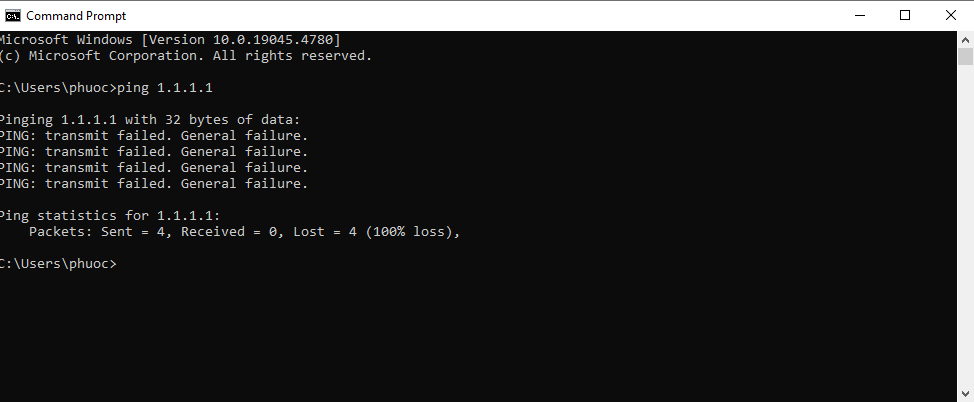

# Circling Dragons: Red Team Lessons From Modern Breaches - Jason Lang

**Red team**: According to chatgpt this is a group of cybersecurity professionals or ethical hackers who simulate real-world cyberattacks on an organization’s systems, networks, or applications to identify vulnerabilities.

https://www.youtube.com/watch?v=i2cJ1vYK5c8

1. Presenter

    Our presenter is Jason Lang, he has more than 15 years of experience in info-sec. Briefly describe his job is to think and act like an attacker, and improve his client defensive.

2. Breaches.

    The first breach he talking about is Verizon in 2023, showing the statistic about the case. Of course, the attack was motivated by money.
    He continues to demonstate how an attack do an SQL brute force, he gave many ways the attacker may do it, but in conclusion the attacker use the most basic which is bursth the firewall rule.
    **Lesson: know the basic stuff.**

    MGM/ Caeser: in this attack, he demonstate the attack choose it target by using social network, in this case is Linkedin. They looking for the most trust-face, so they could start the attack.
    They start calling that actor, he was working as Help Desk, they start asking if willing to install something, or approve something, and just like that the system is breached.
    **Lesson: The best Stage0 is a Phone Call.**

    There are 2 more breaches, but it's out of my reach.

3. Can't fish

    
