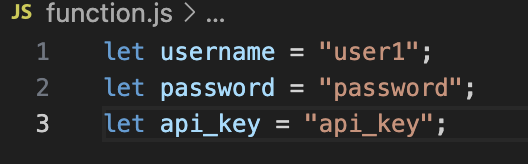
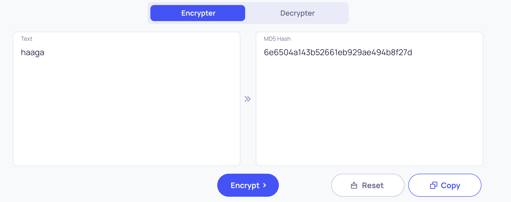
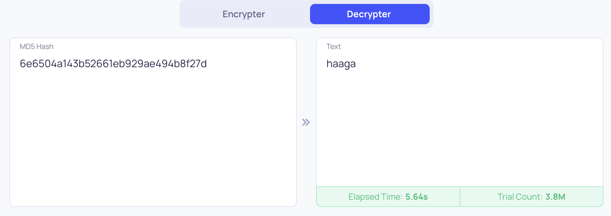

# OWASP: OWASP 10 2021

## A01:2021 – Broken Access Control
### Overview
1. Refer to when sensitive data got leakd or exposed to individuals without authorization.

### Example
1. Elevation of privilege. Acting as a user without being logged in or acting as an admin when logged in as a user.

### How to prevent.
1. Any request from public, deny it by default.

## A05:2021 – Security Misconfiguration
### Overview
1. Mostly misconfiguration software, which lead to vulnerabilities if not properly managed.

### Example
1. Missing appropriate security hardening across any part of the application stack or improperly configured permissions on cloud services.

### How to prevent.
1. An automated process to verify the effectiveness of the configurations and settings in all environments.

## A06:2021 – Vulnerable and Outdated Components
### Overview
1. Abuse out-dated software that contain many vulnerabilities, allow attacker to exploit it.

### Example.
1. If the software is vulnerable, unsupported, or out of date. This includes the OS, web/application server, database management system (DBMS), applications, APIs and all components, runtime environments, and libraries.

### How to prevent.
1. Remove unused dependencies, unnecessary features, components, files, and documentation.

## A03:2021 – Injection
### Overview
1. This is kind of exploitation that allow attacker to extract all data.

### Example
1. Some of the more common injections are SQL, NoSQL, OS command, Object Relational Mapping (ORM), LDAP, and Expression Language (EL) or Object Graph Navigation Library (OGNL) injection

### How to prevent.
1. Use positive server-side input validation. This is not a complete defense as many applications require special characters, such as text areas or APIs for mobile applications.
2. Use LIMIT and other SQL controls within queries to prevent mass disclosure of records in case of SQL injection.

## A02:2021 – Cryptographic Failures
### Overview
1.  Previous known as Sensitive Data Exposure, simply it is a leak sensitive data by bad habit or by acident.

### Example.
1. CWE-259: Use of Hard-coded Password: when you save the account within the code, instead somewhere else more secure like config file.

**I have been working in Software development for approximately 5 years, and I can see myself did this "bad habbit" as well. So, when i read the definition of this CWE, i could recongnize I'm one of them, and i just want to do a small demo, so everyone could see the problem from my perspective.**

2. CWE-327: Broken or Risky Crypto Algorithm, and CWE-331 Insufficient Entropy: the algoritm is not strong enough and could be reverse or descrypt back to orginal information, the encryption pattern is easy to take a guess. 

**Back when I was studying Software Engineering, I was introducted the MD5 encryption and I never use it in the real project, beside academic project. Frankly, when i read the definition, I realized I could using MD5 as a perfcet exmaple to describe the CWE. Moreover, my point here is a strong encryption algorithm, should not be easy to predict the pattern, and decrypt back to original source.**

Figure 1. Encrypt the term "haaga" using MD5.

Figure 2. Decrypt back to clear text.

