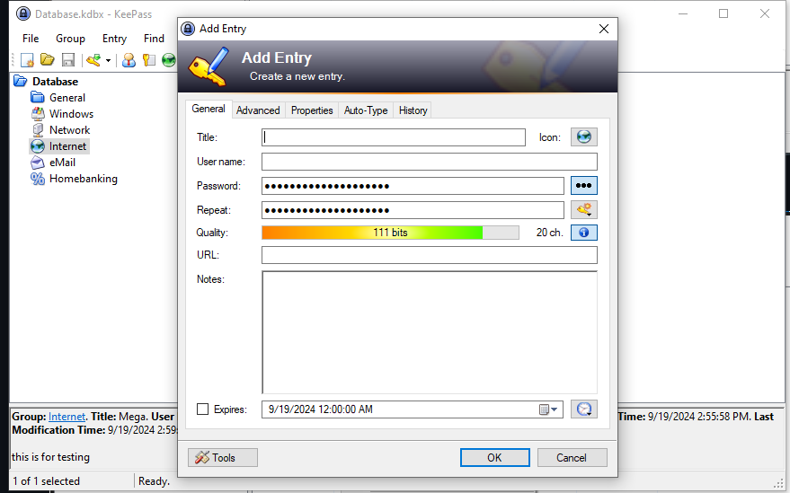

# € Schneier 2015: Applied Cryptography

1. ## Foundation.

- **Messages, Encryption and Decryption**
    The purpose is to disguise the message. The process turn clear text to ciphertext called **Encryption**, a disguised message is called **ciphertext**, the opposite of **Encryption** is **Decryption** which is turn ciphertext back to clear text.

- **Authentication, Integrity, and Nonrepudiation**
    - Authentication: the receiver must have a valid credential to access to message.
    - Integrity: the message have not modified during the transmit process, and the original of the text is still remain.
    - Nonrepudiation: A sender should not be able to falsely deny later that he sent a message.

- **Algorithms and Keys**
    - A cryptographic algorithm is using for encryption or decryption.
    - Key could be random of anything (text, numbers) could be use in encryption and decryption operation.
    - A cryptosystem is combined plaintexts, ciphertexts and keys.

- **Symmetric Algorithms**
    Most symmetric algoritms, the encryption and decryption key are the same.

- **Public-Key Algorithms**
    Designed so the key for encryption could be different to decryption.

- **Cryptanalysis**
    Cryptanalysis is recovering ciphertext back to clear text without a valid key.

- **Security of Algorithms**
    Nothing is absolutely, so the algorithms. Any Algorithm could be breakthoughs in cryptanalysis, but the important that your data is still secure at some level.

- **Computer Algorithms**
    Three main cryptographic algorithms:
        - DES (Data Encryption Standard) is the most popular computer encryption algorithm
        - RSA (named for its creators—Rivest, Shamir, and Adleman) is the most popular public-key algorithm
        - DSA (Digital Signature Algorithm, used as part of the Digital Signature Standard) is another public-key algorithm

- **Steganography**
    Steganography hides secret messages within other messages, making the secret’s existence inconspicuous. Modern techniques involve embedding secret bits in the least significant bits of graphic images, allowing hidden messages without noticeable changes to the image.

- **Substitution Cipher**
    Substitution Cipher is one in which each character in the plaintext is substituted for another character in the ciphertext. The receiver inverts the substitution on the ciphertext to recover the plaintext.
    
- **Transposition Cipher**
    In a transposition cipher, the plaintext characters are shuffled. In a columnar transposition, the message is written in rows and read vertically to create the ciphertext, and decrypted by reversing this process.

- **One-time pad**
    Invented in 1917, uses a set of random key letters for encryption, where each key is used only once to encrypt one character of the message. Both sender and receiver have identical pads, and after encryption or decryption, the used keys are destroyed to ensure security.

2. ## CRYPTOGRAPHIC PROTOCOLS.

- Protocal is a set of steps, that we must follow to achieve something. Moreover, it must be done in the right order.
- **Basic protocals** is encrypt each of individual conversation with separate key, they trade for each other and using it only for communication.

* ## a. Encrypt and decrypt with GNUPG
    The concept is easy to understand, but when come to practice, I messed it up so many times, anyway I managed to done it:

    - Let gen the key from the first person.

    

    - Export the key.

    

    - Simulate the second person

    

    - Send the first key for second person

    

    - Verify and sign the key.

    

    - Now it turn for second person to do previous thing.

    

    - Export the key.

    

    - Sign the second key.

    

    - **Done!!!! you are secured, now it time for send the message**

    - Encypte the message, and see how it look like when encrypted.

    

    - Simulate send the message to first person and decrypt it.

    
* ## b. Password Manager

    **Keypass** - no cloud, open source, easy to use.

    - Start up screen. The software devide, credential into 5 different section, like General, Windows, Network, Internet, Email and Homebanking. Right now, i'm gonna focus on Internet because we're all surf alot on it. 

    

    - Adding the entry.

    

    - Perform entering the credential.
    **IMPORTANT!!! MAKE SURE YOU POINT TO THE RIGHT USERNAME FIELD FIRST, OR ELSE THE AUTO FULL FEATURE WILL PERFORM AT THE WRONG PLACE (Mine was the tool search the entire password on google)**

    

* ## m. OpenSSL.
    OpenSSL is a software library for secure communications.

    - **Encrypt**

    

    echo "this is the message" - this is the original text.

    **enc** like a command to encrypt.

    List of Cipher, i'm gonna choose **aria-192-cbc**

    The only encoding avaible is **base64**.

    

    - **Verify**, make sure the text is encrypted.

    

    - **Decrypt**

    

    It is super easy to use, with just 1 line of comment you can have a really strong encrypted message. It is alreay built-in Linux, so I don't have to installing it.

* ## n. Voluntary bonus: send and receive encrypted message over email.

    - Send and encryption.
    

    - Receive.
    

    - Decrypt with options.
    

    - After Decrypt.
    

* ## o. Frequency distribution of letters for a language

- According to google, the letters N, H and C are the most frequent letters in the Vietnamese language.

- 6 most frequently are **N, H, C ,T, I, G**

* ## p. Install OpenSSH server, connect to it using 'ssh' client.

- Check server status.

- Connect using SSH.

* ## s. ETAOIN

    This is the most interesting task this week. At first, I thought i'm not gonna break it, and then I started to notice the pattern.

    - **DHHP://HIYWLMYCTAIA.OWG**
    This look like an URL and it should be **HTTP**://HIYWLMYCTAIA.**COM**
    Then I conclusion:

    D = H,
    H = T,
    O = C,
    W = O,
    G = M

    - HDMH'B TH -> THMT'B TT it should be THAT'S IT

    M = A,
    T = I,
    B = S

    - BII KWU MH -> SII KOU AT look like SEE YOU AT

    I = E,
    K = Y

    - And manage to crack a little of the URL **HTTP**://HIYWLMYCTAIA.**COM** - > **HTTP**://TEYOLAYCIAEA.**COM**,
    TEYO -> TERO and i'm be like okay it should be this HTTP://TEROKARVINEN.COM

    We have more cracked characters:

    Y = R,
    A = N,
    L = K,
    C = V

    - At this point I just replace and the message is more than 85% decrypted, and here is the completed decrypted message:

     **THAT'S IT. YOU'RE NOW OFFICIALLY A CODEBREAKER! AS YOU SEE, SIMPLE SUBSTITUTION CIPHERS CAN BE BROKEN WITH FREQUENCY ANALYSTS. SEE YOU AT HTTP://TEROKARVINEN.COM**

    

    # Reference

    https://en.wikipedia.org/wiki/Etaoin_shrdlu
    https://docs.openssl.org/master/man1/openssl/#message-digest-commands
    https://learning.oreilly.com/library/view/applied-cryptography-protocols/9781119096726/08_chap01.html#chap01-sec006
    https://terokarvinen.com/2023/pgp-encrypt-sign-verify/
