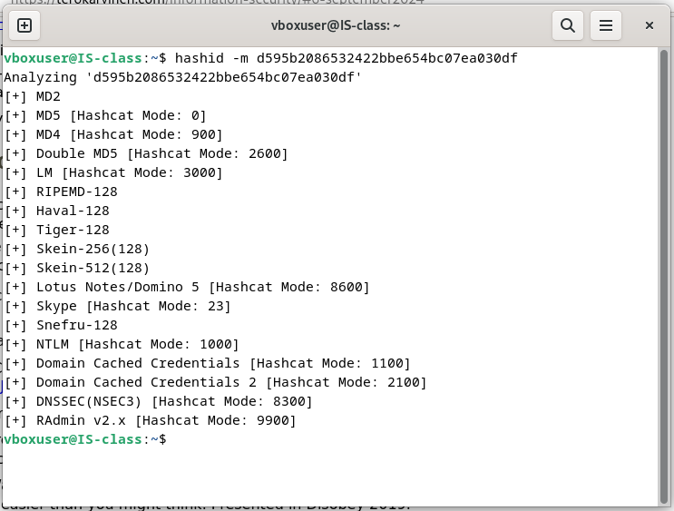

# ONE-WAY FUNCTIONS
- One-way functions are easy to execute, encrypt (compute) and it is hard to reverse back to original form.
- We can take Lego as an example, it is easy to put pieces into a whole complete figure with instruciton paper, but when you tear it down and do it again without the instruction that would be really hard, and not fun anymore. (Only your imagination could help you now)
# ONE-WAY HASH FUNCTIONS
- Some other names: compression function, contraction function, message digest, fingerprint, cryptographic checksum, message integrity check (MIC), and manipulation detection code (MDC).
- The main function is to take the string input (**Pre-image**) and convert it into a fixed length of string(**Hash value**).
- Example: we're all have seen last lession, easy to turn some clear text into hash, or some type of encryptions but it is super hard or impossible to reverse.
## Message Authentication Codes
- MAC, the hash value depends on both the pre-image and the key. It's similar to hash functions, but only those with the key can verify it. A MAC can be created from a hash function, block cipher, or as a dedicated algorithm.
## How can one-way functions apply? 
- I have a login function and MD5 for hashing.
- I Create new user with the hashed password store in the database.
- How the program know to verify correctly the password? Decryption the password everytime when user logining? that would take a lot of their time, so no.
- The program simply just very the previous hashed stored password with the hashing when user trying to logining, same hashing same ciphertext, then the program can verify it.

## a/ Install Hashcat
## PROBLEM
- Can't find the hashcat, the apt-get keep return 404

- Succeed to install from github, but another problem taking place which is the limitation of VirtualBox, its can't fully access the hardware.

- The only option that available is hashcat on windows. The password is **summer**

## b/ Crack this hash: d595b2086532422bbe654bc07ea030df

- ## NOTES: I CAN'T INSTALL HASHCAT ON DEBIAN.
- ## MANAGED TO INSTALL FROM GITHUB BUT THE VIRTUALBOX CAN'T FULLY ACCESS TO HARDWARE (GPU) SO IT CAN'T CRACKING THE HASH. SO I COMBINED TOOL THAT WORK ON BOTH OS.

- Identify the hash type.

- The crack command 

- The result (The red underline is the hash code and the password), password is **disobey**

