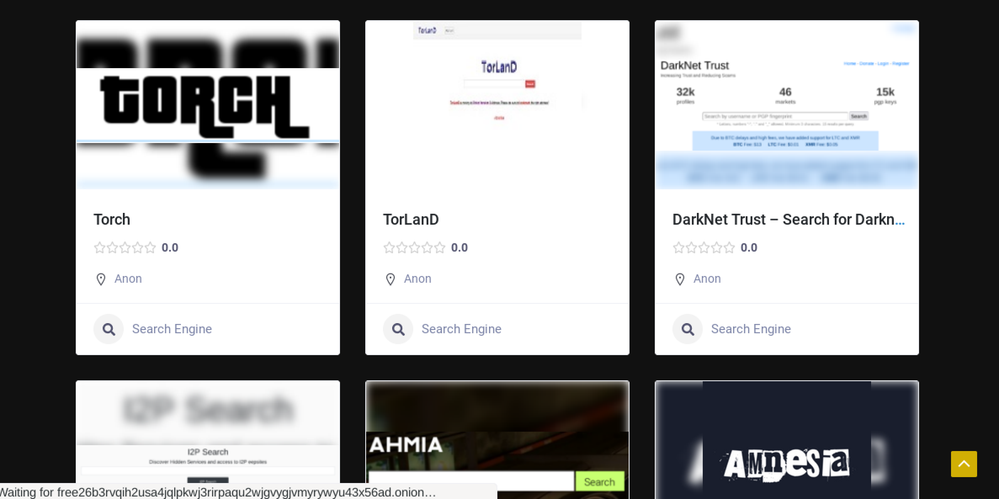
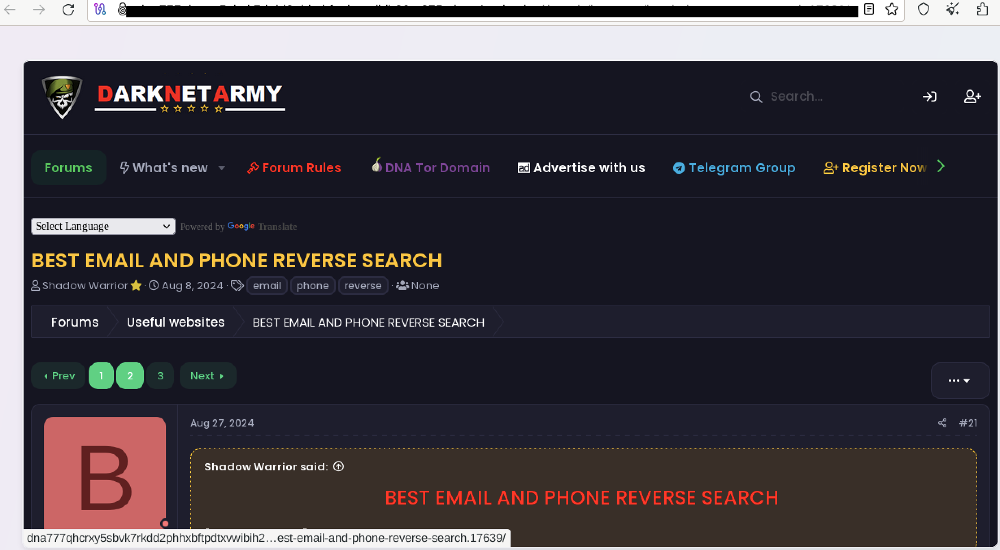
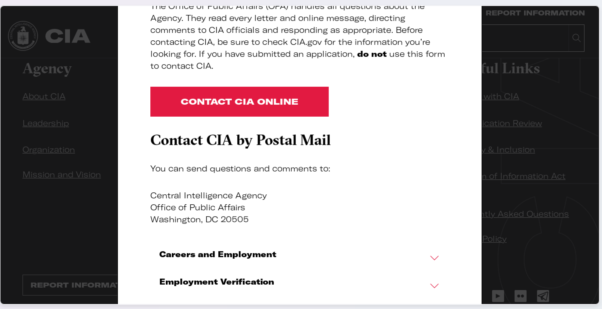

# Quintin 2014 : 7 Things you should know about Tor.
## Tor still works
- Depsite effort to incease the anonymity for Tor, it's still not meet the expectation.
- In conclusion Tor is not broken at a cryptographics level.
## Tor is not only used by Criminals
- It is the most misconceptions we hear about Tor.
- Some Activists use it because its provides anonymity.
- The military uses it for secure communication and planning.
- Jounalists use it to do research on stores and communicate securely with sources.
## Tor does not have a military backdoor.
- The initial development of Tor was funded by the US Navy.
- It has been altered by several very smart cryptographers and security source.
- Tor is open source, so you can look into the code and tell it is fishy or not.
## No one in the US has been prosecuted for running a Tor relay.
- At the time of this summary, running a Tor relay is not illegal under US law.
- But no guarantee in the future, or you won't be contact by the law enforcement.
- If you use Tor for criminal activity then you get yourselve into problem.
## Tor is easy to use.
- Just download the Tor bundle and do some configuration on your own or you can use the default setting, then you all set.
## Tor is not as slow as you think
- It is slower than regular internet connection.
- From my perspective, it is really faster compare to decade ago.
## Tor is not foolproof
- Tor is not **silver bullet** for your own anonymity.
- Tor is some of the strongest anonymity software that exists.

# Shavers & Bair 2016
## Introduction
- Tor is an normal browser that modified from firefox.
- Tor hide user IP when surf on the internet.
- Tor is the most simpliest and freely to use.
## History and Intended Use of The Onion Router
- Tor's intention was for anonymity uses, for example: allow people to connect websites that blocked by oppressive governments, whistleblowers to communicate, whoever desire to working in anonymous.
- It could be use to do the illegal things.
- Designed in 2002 by US government, but not controlled by US goverment or any in specific individual.
- US goverment is trying to deanonymize of it.
## How The Onion Router Works
- The data will travel through many relay with different encryption.
- First layer is called **entry**, once the data is encrypted then its will be stripped and send to next layer.
- Second layer is called **middle**, the previous happens the same in this layer.
- Final layer called **exit**, its connect to user devices with unencrypted connectino.
- The layer doesn's know anything about the traffic, and it's make very difficult, impossible to tracking.
## Tracking Criminals Using Tor
- Now we have a picture on how hard to tracking through Tor.
- Every goverment agency tried to deanonymizing Tor to find criminals or terrorists, but most of the cases were not by exploiting error from Tor rather than the human error made by the suspect.
## FBI did it .. once.
- FBI tried using an exploit of Firefox, to take down a child pornography hosting services.
- One of the weakness of Tor is the users, thier misconfiguration could leak information.
- A good example is the geolocaiton, they hope that the criminals will made by accidentally.
- Many research conducted on Tor hence to deanonymizing Tor by disabling a large of its user. 
- Other theories is gaining to control entry and exit nodes as many as possible.
- The man-in-the-middle attack is a method that bypass the security of middle node and trying to capture between its and the destination.
- The most common goal is to obtain the IP address, subsequently the investigator could find the physical address and seize the evident.
- Depending upon the investigation, you may choose the right approach for each cases.
- One of less draw attention is placing the tracking code in document that sending between the suspect and victim. It's allow investigator to obtain the real IP address of the suspect.
- Tor may giving a lot of warning to its user so they don't make such mistake, hence looking for them in out side Tor is more possible, we can find the behaviour, username, e-mail that could lead to the dark net.
## One Weak Strand of the Silk Road Caused the Crash
- Silk Road is known for a very famous black market for selling illegal drug on dark net.
- The founder fell for his own very sloppy behaviour.
- He had many accounts and activities that connect to each other.
- He even use his real name to asking technical question on Stack Overflow on how to connect program written PHP to connect to Tor network.
- He use his name for many online normal services which led to FBI investigator to connect the dot, and jump to conclusion that him is behind the Silk Road.
## How a Harvard student was busted using Tor
- Harvard student Eldo Kim used Tor to e-mail bomb threats to Harvard staff to avoid taking an exam.
- The school's staff managed to identify that was Eldo Kim even he used Tor to do it.
- He did send the email through Tor and using Guerrilla Mail for more anonymous.
- But he may use unintentionally or falsely another browser at the same time, and it leave a trace and catch the attetion of the school staff.

# a/ Install TOR Browser:
- Open the default browser available which is firefox.
- search for term "Tor browser", and click download for Linux
- It starting download the bundle with format file ***tar.xy**
- In the class, i learned how to do it by using the command **tar xf [name the bundle here]**
- It will extract the package
- Now let cd till we in the folder named **"Browser"**
- In here we will find the file name **start_up_browser**, start it up by using **./start_up_browser**
- The first address i was introducted was **ahmia.fi**, it's a search engine but for darknet.
# b/ Browse Tor network:
- Serach engine for onion sites: it is interesting that ahmia is on the list.

- Marketplace: the latest of Apple's product is absolutely cheaper. I'm not sure i should buy it or not.

- Forum:

- An organization with their physical address:

